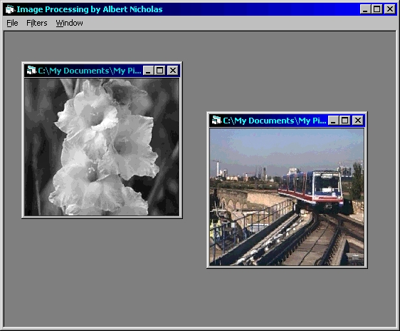



## Image Processing v2\.0

### Description

An updated version of earlier image processing. By using Windows API functions, this project will process images much quicker than the earlier version (this is the fastest way VB can do, I guess). Sample project of image processor application and using MDI form for easy use opening more than one picture. Give it rate and comments, friends :)

Included : sample01.jpg, sample02.jpg - just for sample pictures -

Note : I do not use progress bar (I don't like additional control), just wait, it doesn't take a long time.
 
### More Info
 

             |
---                |---
**Submitted On**   |2000-05-03 22:48:20
**By**             |[Albert Tedja](https://github.com/Planet-Source-Code/PSCIndex/blob/master/ByAuthor/albert-tedja.md)
**Level**          |Advanced
**User Rating**    |4.8 (19 globes from 4 users)
**Compatibility**  |VB 5\.0, VB 6\.0
**Category**       |[Complete Applications](https://github.com/Planet-Source-Code/PSCIndex/blob/master/ByCategory/complete-applications__1-27.md)
**World**          |[Visual Basic](https://github.com/Planet-Source-Code/PSCIndex/blob/master/ByWorld/visual-basic.md)
**Archive File**   |[CODE\_UPLOAD5456532000\.zip](https://github.com/Planet-Source-Code/albert-tedja-image-processing-v2-0__1-7812/archive/master.zip)

